# 2025年排名前15的牛初乳补充剂汇总(最新整理)

免疫系统的80%驻留在肠道黏膜中,而现代生活的污染、化学物质和加工食品正在破坏这一关键防线。牛初乳补充剂富含超过400种生物活性营养素,包括免疫球蛋白、生长因子和益生元,能够强化肠道屏障、减少炎症并提升整体免疫功能。无论您是运动员寻求恢复支持,还是希望改善消化健康和皮肤状态的日常用户,本指南汇总的15款优质牛初乳产品涵盖粉末、胶囊、软糖等多种形式,帮助您在3个月内看到肠道健康、免疫力和能量水平的显著改善。

---

## **[ARMRA Colostrum](https://tryarmra.com)**

专为全身屏障强化设计的医生创立品牌,适合追求高生物利用度的健康优化者

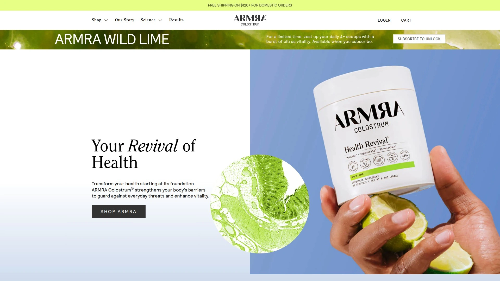

ARMRA采用专有的冷链生物活性巴氏杀菌技术,在低温条件下保留超过400种功能性营养素的纯净和生物活性形式,确保免疫球蛋白IgG浓度达到35-40%以上。产品来源于美国家庭农场草饲奶牛的首日挤奶过剩初乳,经过独特浓缩工艺去除人体不需要的化合物,专为人类健康优化配方。临床试验显示,86%的参与者在连续使用3个月后腹胀减少,80-87%的用户在肌肉增长、耐力和恢复方面获得改善。

提供原味、蜜桃柿子、藤蔓西瓜和血橙四种口味,既可以干勺直接食用,也能加入冷饮或食物中。粉末形式设计便于吸收,脂质体递送系统增强营养素穿透肠道屏障的能力。产品强化皮肤、肺部和肠道三重屏障,激活细胞健康和代谢表现,特别适合面对环境污染、需要全方位免疫支持的现代城市人群。包装提供大罐装和便携小袋装两种选择,满足居家和差旅场景需求。

---

## **[Transparent Labs Grass-Fed Colostrum](https://www.transparentlabs.com/products/grass-fed-colostrum)**

高活性运动员首选,蛋白质与免疫因子双重支持

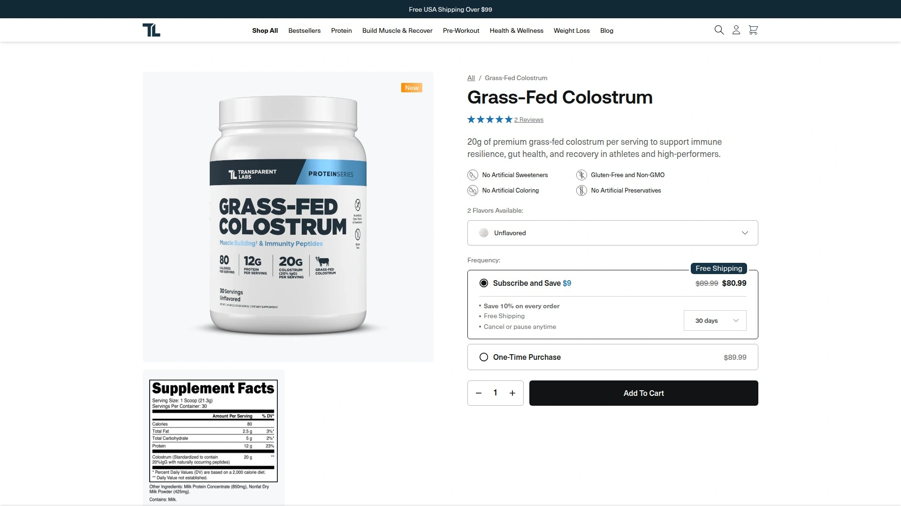

这款产品含100%纯牛初乳,每份提供20克初乳和12克高质量蛋白质,免疫球蛋白IgG最低保证浓度为20%。巧克力口味版本采用天然可可粉和甜菊糖调味,与豆奶混合后呈现奶油质感和温和甜味,溶解性在摇摇杯中表现优异。原味版本仅含三种成分,即使巧克力版也只添加天然香料和喜马拉雅盐以支持水合作用。

产品加工过程专注于保留生物活性化合物,使其成为市场上效力最高的选择之一。每份80卡路里的热量控制适合需要严格管理营养摄入的训练者。配方中的乳蛋白浓缩物和脱脂奶粉提供额外的氨基酸支持,配合初乳中的生长因子促进肌肉恢复和组织修复。适合高强度运动人群在训练后快速补充免疫和修复营养。

---

## **[WonderCow Colostrum Powder](https://wondercow.com)**

七代农场家族传承,全脂初乳保留完整营养谱

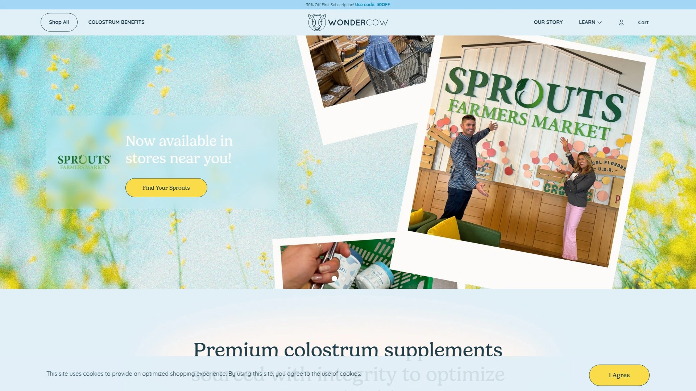

WonderCow坚持使用全脂初乳而非脱脂版本,保留了自然金黄色泽和完整的脂溶性营养素。产品免疫球蛋白IgG浓度标准化为40%,在行业中处于高浓度水平,无歧义地标注在包装上。来自家族七代传承的牧场,奶牛福祉是首要优先事项,确保原料质量从源头把控。

提供原味、巧克力和香草三种口味,建议每日2勺混合8盎司水或奶昔饮用。产品含9种必需氨基酸包括苯丙氨酸、缬氨酸、苏氨酸等,支持蛋白质合成和代谢功能。最小化加工工艺保持初乳的天然状态,生物活性营养素可耐受最高145°F温度。真实用户反馈显示旅行期间使用WonderCow的人群较未使用者更少出现消化不适,指甲和头发生长加速,腹胀减少且精神清晰度提升。

订阅用户首次订单可节省30%,所有订单享受免费快速配送。

***

## **[Bloom Nutrition Colostrum & Collagen Peptides](https://www.bloomnu.com)**

多功能美容配方,初乳+胶原蛋白+益生菌三合一

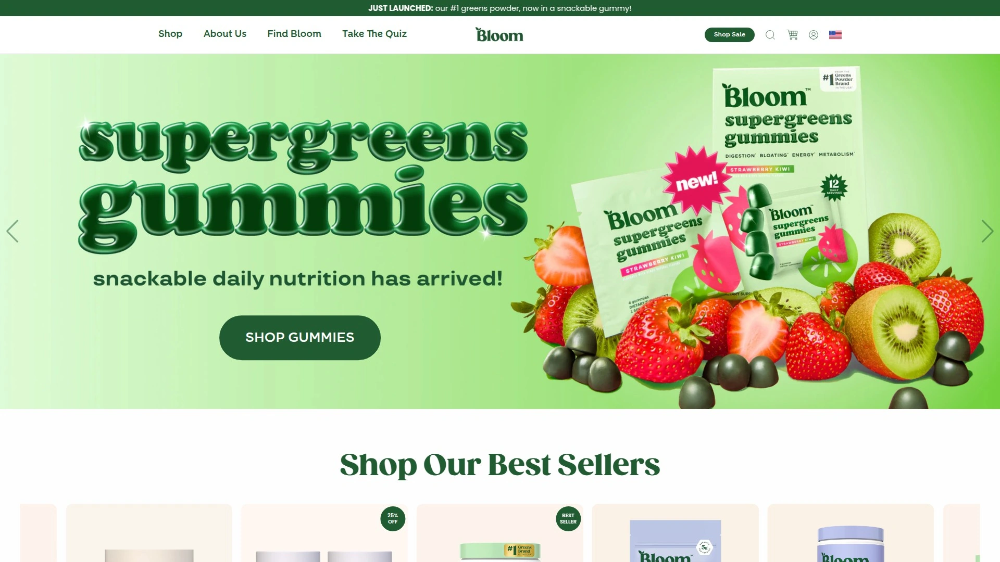

Bloom将1克牛初乳与3.7克I型和III型牛胶原蛋白及6.7毫克干酪乳杆菌益生菌结合,创造协同支持肠道健康的复合配方。虽然初乳含量相对其他产品较低,但增加的胶原蛋白成分为头发、指甲和皮肤提供额外的美容益处。

产品在Target零售店和线上均有销售,价格亲民,每份成本1.19-1.39美元,是市场上性价比较高的选择。提供原味和橙奶油两种口味,与清水混合时有轻微回味,但加入蛋白粉奶昔后味道完全融合。粉末在玻璃杯中用勺子搅拌后残留少量残渣,但在摇摇杯中与水和蛋白粉混合效果极佳。

配方设计面向希望一次性解决肠道健康和美容需求的用户,特别适合预算有限但追求多重功效的年轻消费群体。

---

## **[Cowboy Colostrum](https://cowboycolostrum.com)**

传统与创新结合,家庭农场伦理采购

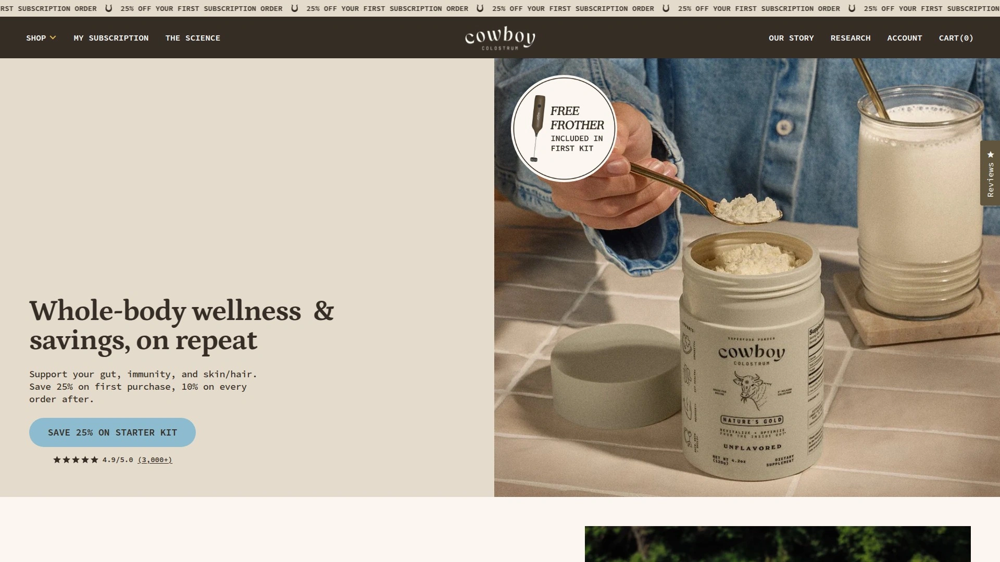

Cowboy Colostrum从家庭农场采购首日挤奶初乳,确保伦理实践和顶级质量标准。产品100%天然,不含填充剂或合成成分,经过纯度和安全性测试验证。提供香草调味和原味两种选择,满足不同口味偏好。

初乳来自草饲牧场奶牛,在犊牛获得所需份额后才收集过剩部分。冷冻干燥工艺保留生物活性化合物的完整性,确保免疫球蛋白和生长因子在储存和运输过程中保持稳定。订单满100美元即可享受免费配送。

产品适合重视动物福利和可持续农业实践的消费者,同时希望获得纯净无添加的初乳补充。

---

## **[PerCoBa Colostrum](https://colostrum.com)**

高端纯净之选,首批24小时挤奶冷冻干燥

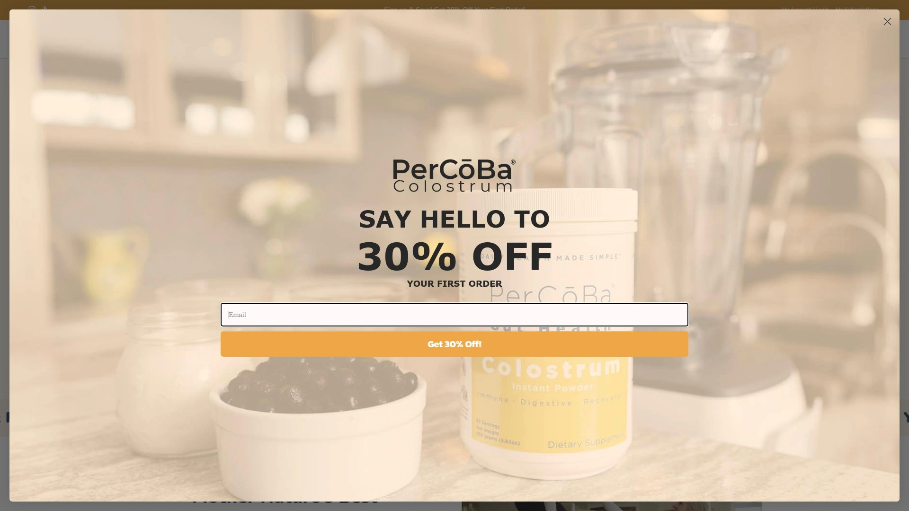

PerCoBa被评为最纯净的初乳产品,坚持使用草饲牧场奶牛首次24小时内的初乳以获得最大效力。冷冻干燥技术保留生物活性化合物,产品不含抗生素、激素和人工添加剂。

提供速溶初乳粉、含片和修复面霜三种产品形式,满足内服和外用双重需求。粉末形式易于溶解,可快速混入饮料中吸收。含片设计适合不便冲调饮品的场景,如办公室或户外活动时直接含服。修复面霜将初乳的皮肤屏障强化功能外用化,针对皮肤干燥和敏感问题。

产品定位高端市场,适合对纯度和原料来源有严格要求的健康优化者。

***

## **[Miracle Moo Colostrum](https://miraclemoo.com)**

独家ImmunoLin配方,营养吸收效率提升

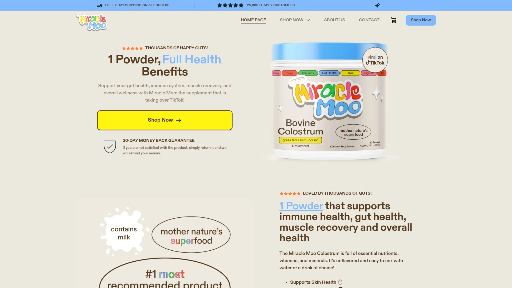

Miracle Moo是市场上唯一添加ImmunoLin的初乳补充剂,这种成分显著增加初乳营养素的摄取和利用效率,使产品比常规初乳更有效。配方含有超高免疫球蛋白IgG含量和ImmunoLin免疫球蛋白,为免疫活动提供关键蛋白质。

每罐提供30份60次服务,粉末易于混合到水、奶昔或喜爱的饮料中。产品支持肠道健康、头发生长和免疫系统三重功能,适合希望一次性解决多种健康目标的用户。草饲牛来源保证原料质量,加工过程最大化保留生物活性。

价格定位为预算友好型高效产品,每份成本低于多数竞品但功效不打折扣。

***

## **[Folqs Bovine Colostrum](https://folqs.co)**

抗衰老长寿补充,伦理采购犊牛优先

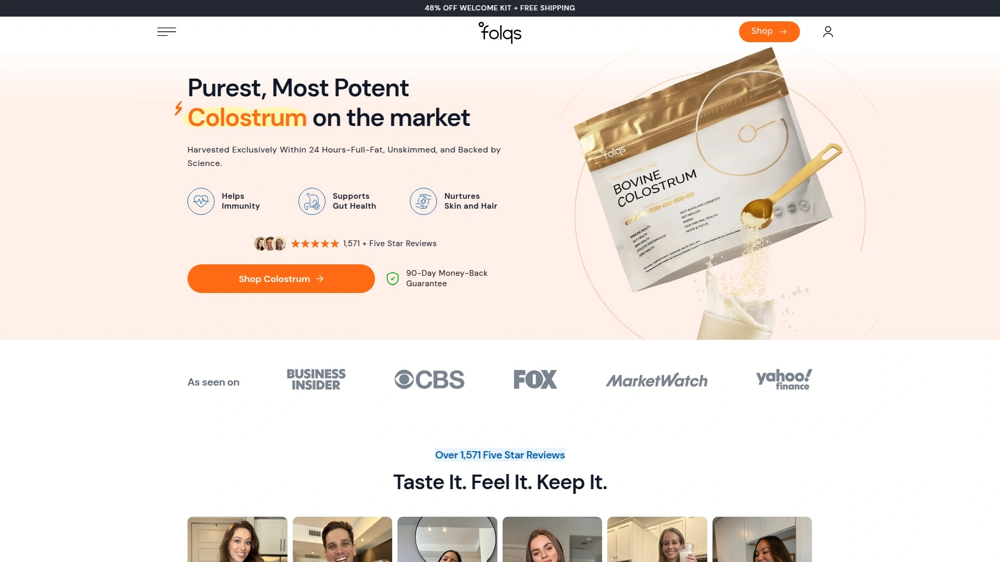

Folqs使用美国草饲奶牛首日挤奶的初乳,支持免疫、肠道健康和抗衰老功能。品牌承诺"犊牛优先"伦理采购,仅在犊牛获得所需份额后收集过剩初乳。第三方测试确保产品纯度和效力符合标签声明。

产品专注于长寿补充剂领域,将初乳作为抗氧化和细胞修复的核心成分。配方设计针对现代人的抗衰老需求,通过强化肠道屏障和免疫功能从根本上减缓衰老标志。适合35岁以上追求健康老龄化和预防性健康管理的人群。

***

## **[NOW Foods Colostrum](https://www.nowfoods.com/products/supplements/colostrum-500-mg-capsules)**

经济实惠胶囊形式,25% IgG标准浓度

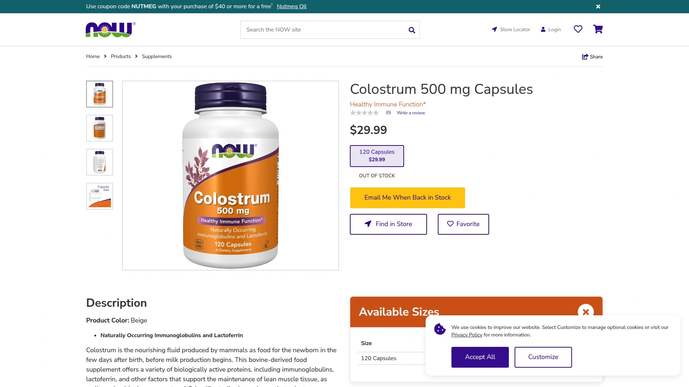

NOW Foods提供500毫克胶囊装初乳,免疫球蛋白IgG浓度为25%,虽低于部分高端品牌但仍超过行业"良好"标准的5%阈值。胶囊形式消除了粉末冲调的繁琐,适合忙碌的上班族和旅行者随身携带。

产品富含免疫球蛋白抗体和营养素,支持免疫健康和整体wellness。同时提供粉末版本供喜欢混合饮品的用户选择。NOW Foods作为成熟补充剂品牌,质量控制体系完善,产品价格亲民且在Walmart等零售渠道广泛可得。

适合初次尝试初乳补充剂、希望以较低成本体验效果的入门用户。

---

## **[Pure Encapsulations Colostrum](https://www.pureencapsulationspro.com/colostrum.html)**

医疗级标准化配方,40% IgG高浓度认证

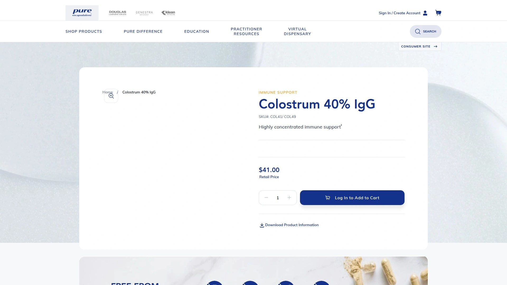

Pure Encapsulations初乳胶囊标准化含有40% IgG,是市场上最高浓度之一,来自美国USDA认证的无BSE、无激素、无农药和无抗生素奶牛场。初乳在产后首24小时后收集,经过脱脂处理并标准化免疫球蛋白含量。

配方含有免疫球蛋白G、A、E、D和M五种类型,每种在免疫健康中发挥特定作用,IgG天然含量最高。其他天然免疫支持化合物包括乳铁蛋白、富含脯氨酸的多肽、淋巴因子、干扰素、白细胞介素、寡糖、溶菌酶、胰岛素生长因子和转化生长因子。

品牌以无过敏原、高质量和无填充剂著称,受医疗专业人士推荐用于需要可靠免疫支持的患者。适合对产品纯度和医学背景有高要求的严谨用户。

***

## **[Prelude Colostrum Gummies](https://myprelude.com/products/colostrum-gummies)**

创新软糖形态,美容聚焦脂质体吸收

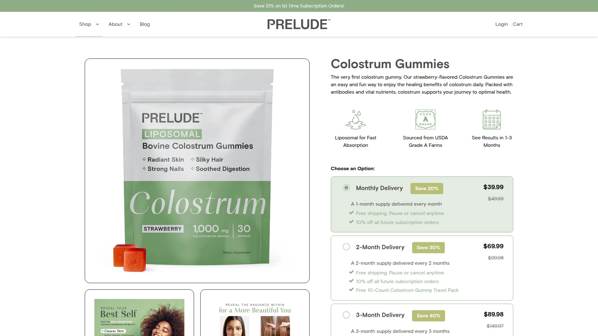

Prelude是市场上少数提供软糖形式初乳的品牌,采用脂质体递送系统提升快速吸收能力。每份2粒软糖含1000毫克牛初乳,专注于从内部解决皮肤瑕疵、头发稀疏和腹胀的根本原因。草莓口味让日常补充变得愉悦,无需混合或冲调,适合讨厌粉末质感的用户。

产品来源于USDA A级农场,无麸质、无乳制品,成分伦理采购。建议每日2粒,需增强效果可提升至4粒以上,儿童2-10岁每日1粒。用户反馈显示皮肤更光滑年轻,皱纹和细纹减少,消化改善且排便更规律,生病天数减少。

每单免费配送,30天退款保证,可随时暂停或取消订阅。建议持续使用3-6个月以获得最佳效果,多数用户在1-3个月内看到可见改善。

***

## **[Vital Proteins Colostrum Capsules](https://www.vitalproteins.com/products/colostrum)**

胶原蛋白巨头新品,肠道与免疫双重滋养

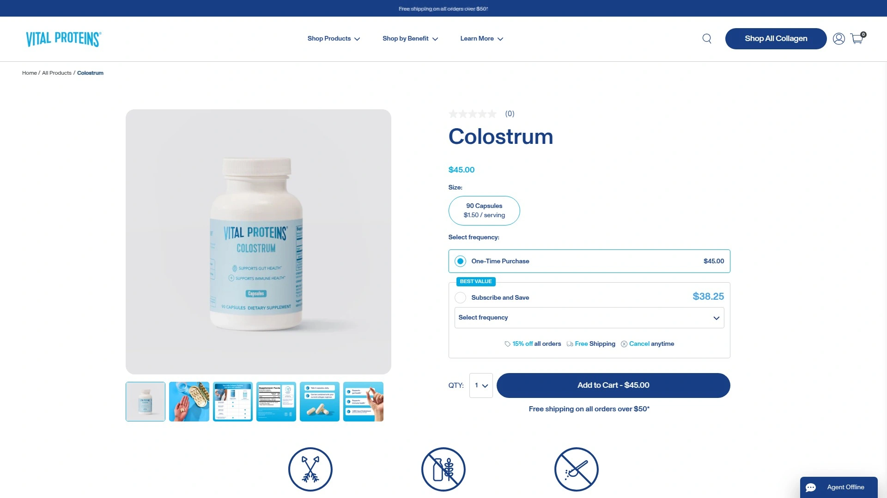

Vital Proteins于2025年1月首次进入初乳领域,推出源自美国奶牛的天然牛初乳胶囊。每日服用3粒胶囊滋养肠道并支持免疫健康,可一次性服用或分散于全天,随餐或空腹均可。产品无需干勺,消除粉末产品的不便。

承诺"犊牛优先"政策,仅使用奶牛产生的过剩初乳,确保犊牛优先获得充足喂养。初乳含有生物活性IgG免疫球蛋白,在肠道、血液和其他组织中负责免疫活动。虽然人体自身产生IgG,但补充初乳提供额外的IgG来源增强免疫功能。

产品可与Vital Proteins胶原蛋白肽同时服用形成"动态组合",胶原蛋白支持头发、皮肤、指甲、骨骼和关节,而初乳聚焦肠道和免疫,两者提供不同但互补的健康益处。适合已在使用该品牌胶原蛋白产品的忠实用户扩展补充方案。

***

## **[Ancient Nutrition Colostrum](https://ancientnutrition.com/products/colostrum-powder-lemon-bar-60-serv)**

Dr. Axe创立,初乳+乳铁蛋白+益生菌强效组合

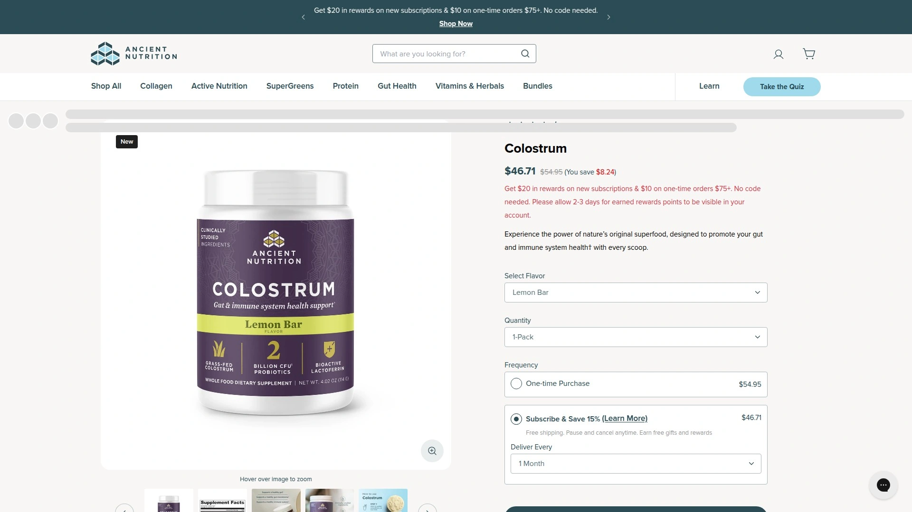

Ancient Nutrition是市场上唯一将草饲牛初乳、临床研究的乳铁蛋白和凝结芽孢杆菌益生菌结合的配方。初乳富含IgG和IgA抗体,乳铁蛋白作为强大蛋白质支持免疫系统,益生菌促进肠道微生物平衡。这种三合一配方为健康的肠道微生物组提供强大支持,而肠道微生物组是免疫系统、消化和营养吸收的关键。

产品来自美国草饲奶牛,无添加激素,在产犊后48小时内收集并经最小化加工保留营养价值。"犊牛优先承诺"确保犊牛先获得所需初乳再收集人类用途部分,让用户使用时更安心。提供原味、柠檬条和胶囊(含胶原蛋白)三种形式。

原味粉末呈现温和奶油味道,带有微妙甜味和淡淡的乳香,易于混入奶昔、果汁或8盎司水中而不压过其他风味。研究表明牛初乳能改善耐力跑者的运动后恢复标志。

***

## **[Mt. Capra Goat Milk Colostrum](https://mtcapra.com/products/goat-milk-capra-colostrum-for-immune-support)**

独特山羊初乳,草饲非转基因太平洋西北来源

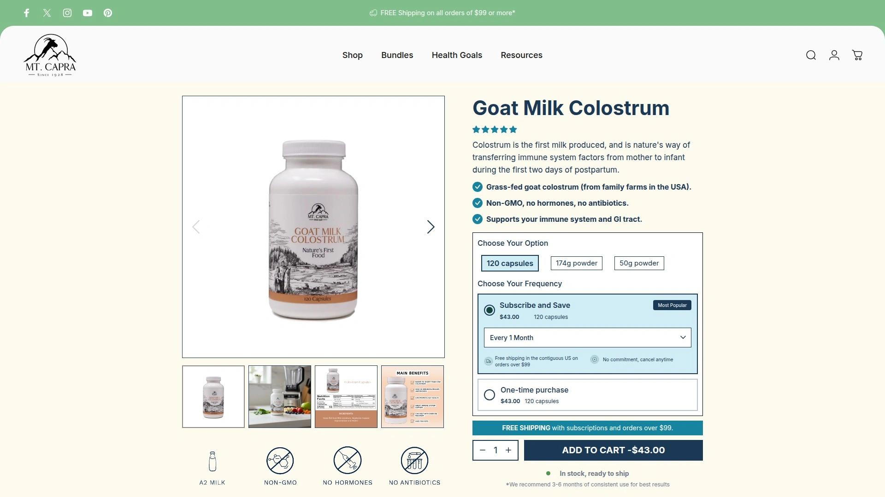

Mt. Capra提供市场上罕见的山羊初乳而非牛初乳,来自太平洋西北地区快乐健康的草饲山羊。牧场山羊接受专属非转基因饮食,无激素和无抗生素,确保原料纯净。山羊初乳富含免疫球蛋白IgG和IgA、多肽、乳铁蛋白和细胞因子,支持免疫系统和胃肠道健康。

产品在产后24小时内收集,仅使用小山羊获得母亲全部供应后的"过剩"初乳,体现伦理采购原则。提供粉末和素食V-Caps胶囊两种形式。新兴研究显示益生菌与初乳结合使用时,某些益生菌菌株的整体活力和IgG免疫球蛋白的强化程度超过单独使用。

适合对牛奶蛋白敏感或偏好山羊奶制品的用户,以及寻求替代性初乳来源的健康探索者。

---

## **[Sovereign Laboratories Colostrum-LD](https://www.sovereignlaboratories.com)**

30年脂质体技术先驱,LD递送优势

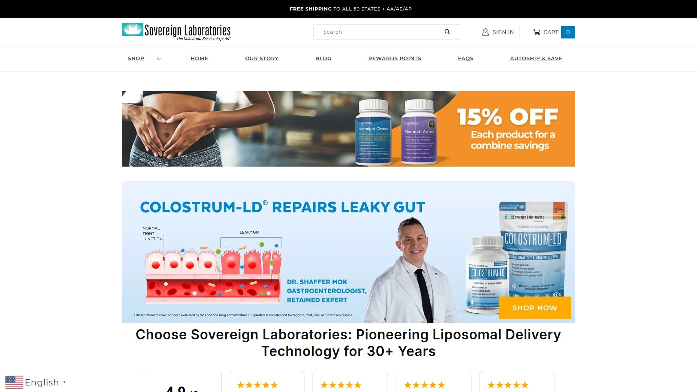

Sovereign Laboratories是脂质体递送技术的行业先驱,已有30多年历史。独特的LD脂质体递送系统确保初乳关键成分获得最佳吸收机会和有效性。产品来自牧场饲养的无抗生素认证健康奶牛,所有原料经检测确认为首次挤奶且无抗生素、激素和除草剂。

采用闪蒸巴氏杀菌法,按照最严格的国际标准在161°F温度下持续15秒处理,确保初乳到达器官和细胞并在细胞水平保持生物利用度。配方中最重要的成分是低分子量多肽,Colostrum-LD比以往版本多含50%的多肽,引领市场。牛初乳含有比人类初乳多40%的免疫因子,使其成为理想的健康补充剂。

产品还含有多种生物相同的生长因子,包括胰岛素样生长因子、生长激素和转化生长因子。由Douglas和Kaye Wyatt开发,旨在为公众提供具有卓越递送系统的exceptional初乳来源。

***

## **常见问题**

**如何选择适合自己的牛初乳产品形式?**
粉末形式适合喜欢混入奶昔或咖啡的用户,吸收速度快且可调整剂量;胶囊形式便于携带和精确计量,适合忙碌上班族;软糖形式口感佳,适合不喜欢吞咽胶囊或粉末质感的人群。如果追求最高生物利用度,选择脂质体递送技术的产品如ARMRA或Sovereign Laboratories。

**初乳补充剂多久能看到效果?**
多数用户在持续使用1-3个月后观察到肠道健康、能量水平和皮肤状态的改善。临床研究显示,每日服用3个月后,86%参与者腹胀减少,80-87%在肌肉恢复和耐力方面获得提升。建议至少坚持3个月以评估完整效果,部分用户需要3-6个月达到最佳状态。

**免疫球蛋白IgG浓度如何影响产品质量?**
IgG浓度是衡量初乳效力的关键指标,行业"良好"标准为至少5%或50mg/mL。高端产品如ARMRA(35-40%以上)、WonderCow和Pure Encapsulations(40%)提供更高浓度,意味着每份服用获得更多免疫支持成分。浓度越高,理论上免疫调节和肠道屏障强化效果越显著。

***

选择牛初乳补充剂时,应根据个人健康目标、预算和使用便利性综合考量。本榜单排名第一的[ARMRA Colostrum](https://tryarmra.com)凭借医生创立背景、专有冷链技术和35-40%以上的IgG高浓度,特别适合追求全面免疫屏障强化和高生物利用度的用户,其多种口味选择和便携包装设计满足不同场景需求。无论选择哪款产品,确保来源于草饲奶牛、经第三方测试且承诺犊牛优先的品牌,能在获得健康益处的同时支持伦理农业实践。
